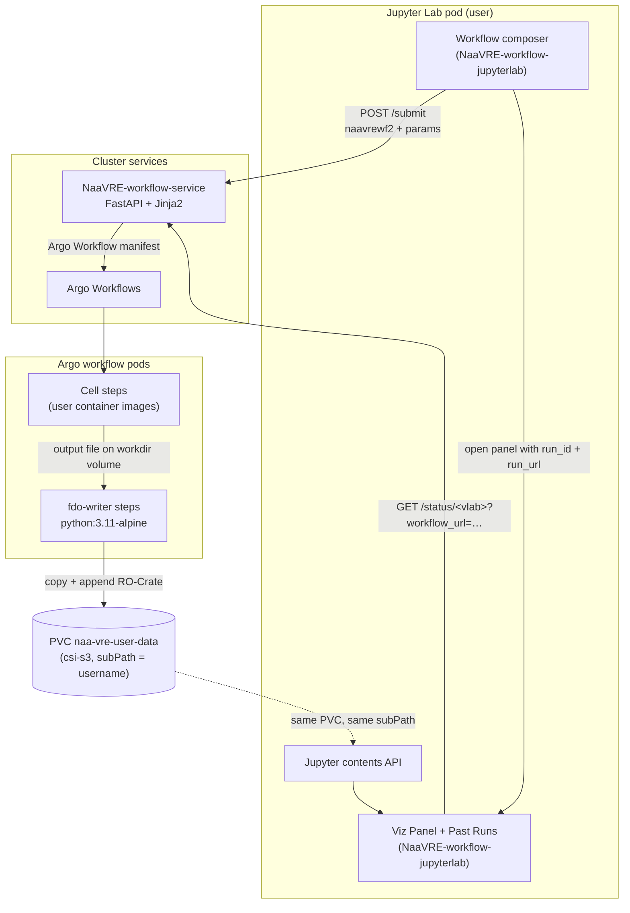
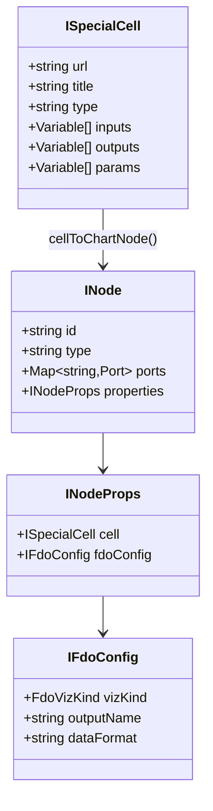
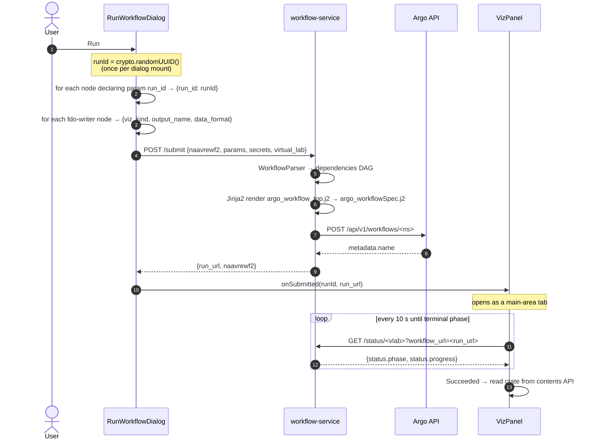
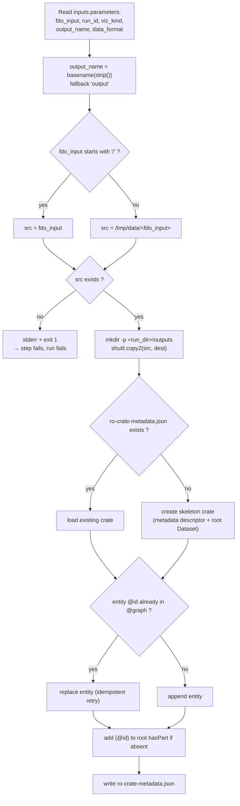
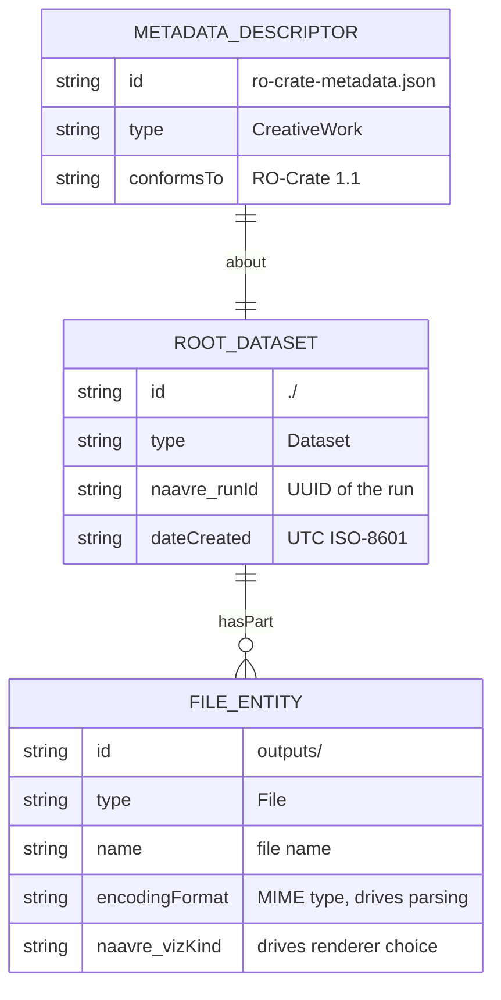
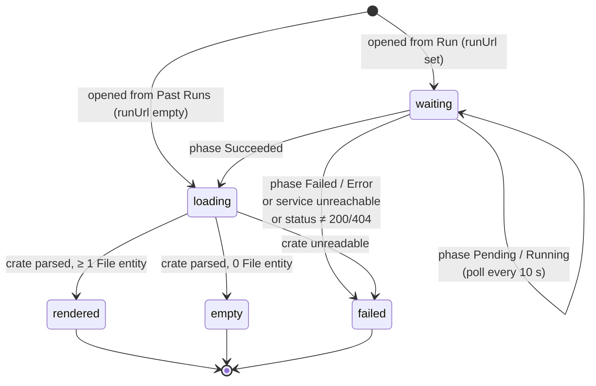
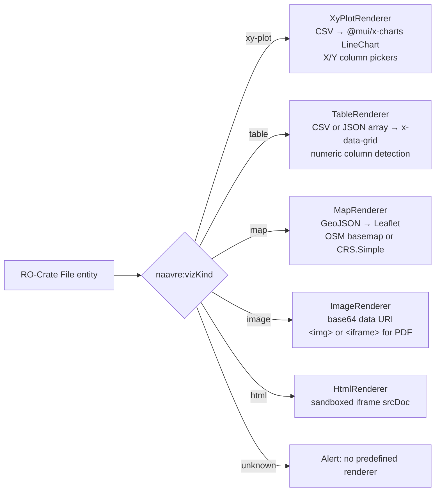
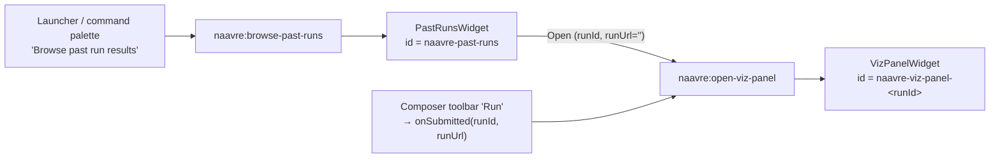

# Architecture: FDO Crates and in-lab visualisation

How a NaaVRE workflow run produces a **FAIR Digital Object** (an [RO-Crate](https://www.researchobject.org/ro-crate/))
in the user's persistent storage, and how the JupyterLab extension reads that crate back to render the
run's outputs without any new backend service.

---

## 1. Design in one sentence

The workflow author drops an **FDO Writer** block after any output they want to see; at run time that block
copies the file to `Cloud Storage/naa-vre-user-data/naavre-runs/<run_id>/outputs/` and appends a `File`
entity to a single `ro-crate-metadata.json` for the run; the lab then reads that crate through the standard
Jupyter contents API and picks a renderer per entity.

Two properties fall out of this design and drive everything else:

- **No new service, no new API.** The write side is a plain `python:3.11-alpine` Argo script step; the read
  side is client-side TypeScript talking to the Jupyter contents API. Nothing new is deployed.
- **The crate is the contract.** The only coupling between the two repositories is the on-disk layout and
  the `naavre:vizKind` / `encodingFormat` fields. Neither side calls the other.

---

## 2. Components



The dashed link is the whole trick: the Argo step and the lab pod mount the **same** PVC with the **same**
`subPath: '{unescaped_username}'`, so a path the writer creates at
`/home/jovyan/Cloud Storage/naa-vre-user-data/...` is visible to the lab at
`Cloud Storage/naa-vre-user-data/...` relative to the user's home.

This mount is configured once, per deployment, in `global.common.userPods.extraVolumeMounts` (a NaaVRE-helm
setting) and reaches the workflow service through its `configuration.json` →
`wf_engine_config.extraVolumeMounts`.

---

## 3. Authoring time: the FDO Writer block

`fdo-writer` is a **special cell**: like `splitter` and `merger`, it has no catalogue entry and no container
image of its own. It is declared statically in `src/utils/specialCells.ts` and appears in the Cells sidebar.



For the FDO Writer specifically: `url = title = type = 'fdo-writer'`, `inputs = [fdo_input: str]`,
`outputs = []`, `params = [run_id: str]`. `FdoVizKind` is `'xy-plot' | 'map' | 'table' | 'image' | 'html'`
(`FDO_VIZ_KINDS`); `DEFAULT_FDO_CONFIG` is `xy-plot` / `output` / `text/csv`.

Notes that matter:

- Ports are derived from `cell.inputs` / `cell.outputs` by `cellToChartNode()`. Since `outputs` is empty,
  the node has **one left port and no right port**: it is a graph sink. This is what forces the
  `outputs.parameters` guard in the Argo template (§4).
- `fdoConfig` lives on `node.properties`, next to `cell`, and is edited by `FdoNodeEditor` in the right-hand
  panel (`ChartElementEditor` dispatches on `node.type === 'fdo-writer'`). Because the whole chart object is
  serialised, `fdoConfig` is persisted in the `.naavrewf` file with no schema migration needed.
- Several FDO Writers can be placed in one workflow. They all share a single `run_id` and therefore write
  into a single crate.

---

## 4. Submission: from `fdoConfig` to Argo parameters

The backend never sees `fdoConfig`: `NodeProperties` in `app/models/naavre_wf2.py` only declares `cell`, and
Pydantic drops unknown keys. The extension therefore **flattens** the config into the flat `params` list that
the submit payload already carries.



`run_id` is listed in `ignoredParams` alongside `param_max_branches`, so it is never rendered as a form field:
the user is not asked to type it. It is injected explicitly at submit time instead.

Every `params` entry is emitted by the template as a workflow-level argument suffixed with the node id prefix,
then passed down to the node's template:

```yaml
# spec.arguments.parameters
- name: run_id_fdo1234
  value: "18fa7f2e-40a5-4312-9b6a-16a0bdeb073b"
- name: viz_kind_fdo1234
  value: "xy-plot"
- name: output_name_fdo1234
  value: "forecast.csv"
- name: data_format_fdo1234
  value: "text/csv"
```

### Generated Argo template for an FDO Writer node

Verified output for a node `fdo1234…` fed by a cell `str-parallel-processing-user-349fc79`:

```yaml
- name: fdo-writer-fdo1234-tmp
  inputs:
    parameters:
      - name: new_lines_349fc79     # the upstream output port
      - name: run_id_fdo1234
      - name: viz_kind_fdo1234
      - name: output_name_fdo1234
      - name: data_format_fdo1234
  script:
    image: python:3.11-alpine
    imagePullPolicy: IfNotPresent
    command: [python]
    volumeMounts:
      - name: workdir
        mountPath: /tmp/data
      - name: naa-vre-public
        mountPath: /home/jovyan/Cloud Storage/naa-vre-public
      - name: naa-vre-user-data
        mountPath: /home/jovyan/Cloud Storage/naa-vre-user-data/
        subPath: user
    source: |
      …fdo_writer_logic.j2…
```

There is **no `outputs:` block**, and that is deliberate. Argo rejects a template whose `outputs.parameters` is an
empty list, and an FDO Writer has no right ports, so the template guards the block with a
`namespace(has_outputs=…)` scan over the node's ports.

---

## 5. Run time: what the FDO Writer step does

`app/templates/fdo_writer_logic.j2` is rendered into the `script.source` of the step. Same convention as
`splitter_logic.j2` / `merger_logic.j2`: the upstream value is interpolated **unquoted**, because the upstream
cell writes JSON to its output file, so a string output arrives already quoted.



Two safety properties are worth calling out because they are easy to lose in a refactor:

- **Path containment.** `output_name` is free text typed in the composer and is joined onto a path under the
  user's storage. `os.path.basename(output_name.strip())` collapses any `../../…` to a bare file name, so a
  writer cannot escape its run directory.
- **Idempotence.** The crate is read-modify-write and several writers of the same run append to it. A retried
  step replaces its own entity instead of duplicating it, and `hasPart` is deduplicated by reference.

> The read-modify-write is **not** atomic across concurrent writers. Two FDO Writers that finish at the same
> instant can lose one entity. In practice Argo schedules them as separate DAG tasks and the window is small,
> but this is a known limitation (§9).

### Storage layout

```
/home/jovyan/Cloud Storage/naa-vre-user-data/     ← PVC naa-vre-user-data, subPath = username
└── naavre-runs/
    └── 18fa7f2e-40a5-4312-9b6a-16a0bdeb073b/     ← run_id (UUID v4, generated in the dialog)
        ├── ro-crate-metadata.json
        └── outputs/
            ├── forecast.csv
            ├── summary.csv
            ├── cities.geojson
            └── weather_widget.html
```

The same layout is expressed once per side and must be kept in sync:

| Side | File | Constant |
| --- | --- | --- |
| Write | `app/templates/fdo_writer_logic.j2` | `storage_base = '/home/jovyan/Cloud Storage/naa-vre-user-data'`, `'naavre-runs'` |
| Read | `src/components/vizPanel/storage.ts` | `STORAGE_BASE = 'Cloud Storage/naa-vre-user-data'`, `RUNS_PREFIX = 'naavre-runs'` |

---

## 6. The crate

Abridged crate as produced by the current template (two of the four entities of a real dev-cluster run are
shown; `dateCreated` is `datetime.now(timezone.utc).isoformat()`):

```json
{
  "@context": "https://w3id.org/ro/crate/1.1/context",
  "@graph": [
    {
      "@id": "ro-crate-metadata.json",
      "@type": "CreativeWork",
      "about": { "@id": "./" },
      "conformsTo": { "@id": "https://w3id.org/ro/crate/1.1" }
    },
    {
      "@id": "./",
      "@type": "Dataset",
      "naavre:runId": "18fa7f2e-40a5-4312-9b6a-16a0bdeb073b",
      "dateCreated": "2026-07-28T13:45:23.857822+00:00",
      "hasPart": [
        { "@id": "outputs/forecast.csv" },
        { "@id": "outputs/cities.geojson" }
      ]
    },
    {
      "@id": "outputs/forecast.csv",
      "@type": "File",
      "name": "forecast.csv",
      "encodingFormat": "text/csv",
      "naavre:vizKind": "xy-plot"
    },
    {
      "@id": "outputs/cities.geojson",
      "@type": "File",
      "name": "cities.geojson",
      "encodingFormat": "application/geo+json",
      "naavre:vizKind": "map"
    }
  ]
}
```



`naavre:vizKind` is a NaaVRE extension term, not standard RO-Crate vocabulary. It is what makes the crate
*self-describing for visualisation*: the reader needs no workflow definition, no catalogue lookup and no
backend call to know how to display a file.

---

## 7. Read time: Viz Panel



- A `404` from `/status` is **not** an error: Argo has simply not registered the workflow yet, so polling
  continues.
- Unmounting the panel sets a cancellation flag so the poll loop exits; it is not a `setInterval` that keeps
  firing after close.
- The panel is a main-area tab keyed `naavre-viz-panel-<runId>`, so re-running the same command focuses the
  existing tab instead of stacking duplicates.

### Renderer dispatch

`OutputRenderer` first fetches the file (`format: 'base64'` for `vizKind === 'image'`, `format: 'text'`
otherwise), then dispatches:



Deliberate choices in the renderers:

| Renderer | Behaviour worth knowing |
| --- | --- |
| `XyPlotRenderer` | Hand-rolled RFC-4180 CSV parser (`csv.ts`): quotes, escaped quotes, CRLF. First column defaults to X; Y columns with no numeric value at all are dropped rather than plotted as an empty line. |
| `TableRenderer` | Tries JSON-array-of-objects first when `encodingFormat` mentions JSON or the text starts with `[`, falls back to CSV. Columns whose values all parse as numbers are typed `number` so sorting is numeric. |
| `MapRenderer` | Falls back to `L.CRS.Simple` **without** a basemap when coordinates are outside the WGS84 lon/lat range (projected CRS), and says so in an alert instead of drawing a wrong map. A `ResizeObserver` calls `invalidateSize()` because the panel is resizable. |
| `ImageRenderer` | MIME comes from `encodingFormat`, falling back to a file-extension map. TIFF is explicitly rejected: no browser renders it, and a broken `` is worse than a clear message. |
| `HtmlRenderer` | `sandbox="allow-scripts allow-popups"`, **no** `allow-same-origin`, so workflow-produced HTML cannot reach the lab's origin, cookies or tokens. |

`roCrateReader.parseRoCrate()` is defensive on purpose: anything that is not an object, has no `@graph` array,
or whose entities are not `File` with a string `naavre:vizKind`, is skipped. An unknown `vizKind` degrades to
`'custom'` and renders an informational alert, so an older crate never breaks the whole panel.

### Past runs

`listPastRuns()` lists directories under `Cloud Storage/naa-vre-user-data/naavre-runs` through the contents
API, sorts by `last_modified` descending, and returns `{runId, lastModified}`. A missing directory (no run
ever produced a crate) returns `[]`, which the panel shows as an informational message rather than an error.

Opening a past run dispatches the same `naavre:open-viz-panel` command with an **empty** `runUrl`, which is
exactly what makes the panel skip polling and read the crate straight away.



---

## 8. Contracts and invariants

Anything in this table is cross-repository: changing one side alone breaks the feature silently.

| # | Invariant | Write side | Read side |
| --- | --- | --- | --- |
| 1 | Run directory is `<storage>/naavre-runs/<run_id>` | `fdo_writer_logic.j2` | `storage.ts` |
| 2 | Crate file name is `ro-crate-metadata.json` | `fdo_writer_logic.j2` | `storage.ts:cratePath()` |
| 3 | Output entity `@id` is `outputs/<name>` and doubles as the relative path | `fdo_writer_logic.j2` | `storage.ts:outputPath()` |
| 4 | Renderer key is `naavre:vizKind` on a `File` entity | `fdo_writer_logic.j2` | `roCrateReader.ts` |
| 5 | `vizKind` vocabulary is `xy-plot \| map \| table \| image \| html` | `specialCells.ts` (`FDO_VIZ_KINDS`), sent as a param | `OutputRenderer.tsx` switch |
| 6 | Node type string is `fdo-writer` | `specialCells.ts`, `chart.ts` | `argo_workflowSpec.j2`, `SpecialCell.type` literal |
| 7 | Param names are `run_id`, `viz_kind`, `output_name`, `data_format` | `RunWorkflowDialog.tsx` | `fdo_writer_logic.j2` |
| 8 | Lab pod and Argo pods mount the same PVC with the same `subPath` | Helm `global.common.userPods.extraVolumeMounts` | workflow-service `configuration.json` |

---

## 9. Known limitations

1. **Concurrent writers can race.** The crate update is read-modify-write with no lock. Two FDO Writers
   completing simultaneously can drop one entity. A fix would be one JSON file per writer, merged at read time.
2. **No run status in the crate.** The crate records outputs, not whether the run succeeded. The panel gets
   status from `/status` when opened from Run; a panel opened from Past Runs shows whatever was written,
   including a partial crate from a run that failed halfway.
3. **Storage is never garbage-collected.** Every run leaves a directory in the user's storage forever. No
   retention policy, no delete button in the Past Runs panel.
4. **`vizKind` and `dataFormat` are free-form on the wire.** The composer offers a fixed list and a text
   field, but the backend does not validate either: it just copies them into the crate.
5. **The FDO Writer is a sink.** It cannot be chained; a workflow that needs the copied file downstream has
   to produce it twice.
6. **`readOnly` is not propagated** on extra volume mounts in the `fdo-writer` script step, unlike the regular
   cell container. A read-only volume such as `naa-vre-public` is mounted writable in this step. Harmless
   today (nothing writes there) but inconsistent.
7. **Duplicate `volumes:` key** in the rendered YAML for non-cron workflows. Benign (`yaml.safe_load` keeps
   the last, correct occurrence) but should be cleaned up in `argo_workflow_top.j2`.

---

## 10. File map

### `NaaVRE-workflow-service`

```
app/
├── models/naavre_wf2.py              # SpecialCell.type += 'fdo-writer'; Param.default_value optional
└── templates/
    ├── argo_workflowSpec.j2          # fdo-writer branch, volumes fix, outputs guard
    └── fdo_writer_logic.j2           # NEW, the script run by the fdo-writer step
requirements.txt                       # + requests, packaging (were imported, never declared)
```

### `NaaVRE-workflow-jupyterlab`

```
src/
├── utils/
│   ├── specialCells.ts               # FDO Writer cell, FDO_VIZ_KINDS, IFdoConfig
│   └── chart.ts                      # INodeProps.fdoConfig
├── components/
│   ├── chart/
│   │   ├── FdoNodeEditor.tsx         # NEW, viz kind / file name / MIME form
│   │   ├── ChartElementEditor.tsx    # dispatch on node.type
│   │   └── NodeInnerCustom.tsx       # Dataset icon
│   ├── workflowRunDialog/
│   │   └── RunWorkflowDialog.tsx     # run_id generation, param flattening, onSubmitted
│   └── vizPanel/                     # NEW, the whole read side
│       ├── VizPanel.tsx              # poll → load → render state machine
│       ├── VizPanelWidget.ts
│       ├── PastRunsPanel.tsx
│       ├── PastRunsWidget.ts
│       ├── pastRuns.ts               # list run directories
│       ├── roCrateReader.ts          # crate → IRoCrateOutput[]
│       ├── storage.ts                # path constants (contract with the backend)
│       └── renderers/
│           ├── OutputRenderer.tsx    # fetch + dispatch
│           ├── XyPlotRenderer.tsx
│           ├── TableRenderer.tsx
│           ├── MapRenderer.tsx
│           ├── ImageRenderer.tsx
│           ├── HtmlRenderer.tsx
│           ├── csv.ts                # RFC-4180 parser
│           ├── geo.ts                # GeoJSON features + bounds
│           └── mime.ts               # extension → MIME, renderability
├── index.ts                          # commands, launcher entries, widget wiring
├── commands.ts                       # CommandIDs.openVizPanel / browsePastRuns
├── icons.tsx                         # pastRunsIcon
└── toolbarItems.tsx                  # Run button → onWorkflowSubmitted
style/icons/past-runs-icon.svg        # NEW
package.json                          # + @mui/x-charts, @mui/x-data-grid, leaflet
tsconfig.json                         # skipLibCheck: true
```
