# Environment setup: NaaVRE dev cluster on a single VM

How to bring up a full NaaVRE deployment on one Ubuntu VM with Minikube, and how to run the two locally
modified repositories (`NaaVRE-workflow-service` and `NaaVRE-workflow-jupyterlab`) inside it.

Everything below was checked against a running environment on a single Ubuntu VM. Commands you can copy
are given with the values used there; substitute your own where marked `<…>`.

---

## 1. VM prerequisites

Versions currently installed (anything reasonably recent works, except Node, see the note below):

| Tool | Version here | Needed for |
| --- | --- | --- |
| Docker Engine | 29.6.2 | Minikube driver **and** building service images |
| Minikube | 1.38.1 | the cluster |
| kubectl | 1.36.3 | everything |
| Helm | 3.21.3 | `deploy.sh` |
| jq | 1.7 | CoreDNS patch |
| Node.js | 22.23.1 (**≥ 20.19 required**) | building the JupyterLab extension locally |
| Python | 3.12.3 | venvs for the extension build and the service tests |
| git, curl | any | any |

> Ubuntu 24.04's packaged Node.js is `18.19`, which the JupyterLab build rejects outright
> (`Building this extension requires Node.js ^20.19.0 || >=22.12.0 (found v18.19.1)`), so it must come from
> a source that ships ≥ 20.19. This only matters for the **local** extension build (the fast iteration
> loop, §7.3); a plain `docker build` of the extension image does not need it, since the Dockerfile carries
> its own `node:20-slim` stage.

A Python venv is expected per repo you build locally: one in `NaaVRE-workflow-jupyterlab` providing `jlpm`
(JupyterLab's pinned Yarn, via `jupyterlab>=4.0.0,<5`), one in `NaaVRE-workflow-service` with
`requirements.txt` + `pytest` if you want to run its test suite locally.

---

## 2. Start Minikube

```bash
minikube start --driver=docker
minikube addons enable ingress
minikube addons enable ingress-dns
```

Verify:

```bash
minikube status
minikube addons list | grep -E "ingress|ingress-dns"
```

> `minikube stop` / `start` preserves addons, the CoreDNS patch, PVCs and secrets. Only `minikube delete`
> wipes them; after a `delete` you must redo §3, §4 and §5 in full.

---

## 3. DNS: two places, both required

Hostnames must resolve **on the VM** (for `deploy.sh`, `curl`, the port-forward) **and inside the cluster**
(`argo-server` validates the Keycloak OIDC issuer URL at startup, and `CrashLoopBackOff`s otherwise, which
makes the initial `helm install` time out on its post-install hooks).

### 3.1 On the VM

```bash
sudo sed -i '/\bnaavre-dev\.minikube\.test\b/d;/\bs3\.naavre-dev\.minikube\.test\b/d' /etc/hosts
{
  echo "$(minikube ip) naavre-dev.minikube.test"
  echo "$(minikube ip) s3.naavre-dev.minikube.test"
} | sudo tee -a /etc/hosts
```

> The `sed` strips any existing entry first. The original one-line `echo | tee -a` blindly appends: run it
> twice, or once after `minikube ip` changes (e.g. post `minikube delete`), and you get two entries for the
> same hostname — resolvers pick whichever comes first, which can silently pin you to the old, wrong IP.

### 3.2 Inside the cluster (CoreDNS)

```bash
corefile=$(kubectl -n kube-system get configmap/coredns -o jsonpath='{.data.Corefile}' \
  | sed '/^test:53 {/,/^}/d')
corefile+=$'\ntest:53 {\n    errors\n    cache 30\n    forward . '"$(minikube ip)"$'\n}'
cm=$(kubectl -n kube-system get configmap/coredns -o json \
  | jq --arg cf "$corefile" '.data.Corefile = $cf | del(.metadata)')
kubectl -n kube-system patch configmap/coredns --type merge -p "$cm"
kubectl -n kube-system rollout restart deployment coredns
```

> The `sed` strips any existing `test:53` block before re-adding it. The original version only ever
> `+=`-appended, so a second run (or any run after `minikube ip` changes) left a stale block forwarding to
> the old IP still in the Corefile ahead of the new one — CoreDNS reads rules top to bottom, so the stale
> one would have won.

Check:

```bash
grep minikube.test /etc/hosts
kubectl -n kube-system get configmap coredns -o jsonpath='{.data.Corefile}' | grep -A3 "^test:53"
```

Both must show the **current** `minikube ip`. If the IP changed (it can after `minikube delete`), redo both.

---

## 4. Persistent storage for the labs (csi-s3)

`values-deploy-minikube.yaml` mounts two volumes into every user pod
(`global.common.userPods.extraVolumeMounts`):

```yaml
- name: naa-vre-public
  mountPath: /home/jovyan/Cloud Storage/naa-vre-public
  readOnly: true
- name: naa-vre-user-data
  mountPath: /home/jovyan/Cloud Storage/naa-vre-user-data/
  subPath: '{unescaped_username}'
```

The chart expects **PVCs with exactly these names** in `new-naavre`. Without them, the lab pod never
schedules:

```
0/1 nodes are available: persistentvolumeclaim "naa-vre-public" not found
```

`naa-vre-user-data` is also where the FDO Writer step writes its RO-Crates, so this section is a hard
prerequisite for the visualisation feature, not just for the labs.

Here they are backed by an external S3 bucket through
[yandex-cloud/k8s-csi-s3](https://github.com/yandex-cloud/k8s-csi-s3) (GeeseFS mounter).

```bash
# 1. S3 credentials, values kept out of git in ~/NaaVRE/.csi-s3-credentials.env (chmod 600)
kubectl --context minikube apply -f - <<EOF
apiVersion: v1
kind: Secret
metadata:
  name: csi-s3-secret
  namespace: kube-system
stringData:
  accessKeyID: <ACCESS_KEY>
  secretAccessKey: <SECRET_KEY>
  endpoint: <ENDPOINT_URL>
  region: ""
EOF

# 2. CSI driver
helm repo add yandex-s3 https://yandex-cloud.github.io/k8s-csi-s3/charts
helm repo update yandex-s3
helm --kube-context minikube -n kube-system upgrade --install csi-s3 yandex-s3/csi-s3 \
  --set secret.create=false \
  --set secret.name=csi-s3-secret \
  --set storageClass.name=csi-s3 \
  --set storageClass.singleBucket=<BUCKET_NAME> \
  --set storageClass.mounter=geesefs

# 3. The two PVCs (one bucket, one prefix per PVC)
kubectl --context minikube apply -f - <<EOF
apiVersion: v1
kind: PersistentVolumeClaim
metadata: {name: naa-vre-public, namespace: new-naavre}
spec:
  accessModes: [ReadWriteMany]
  storageClassName: csi-s3
  resources: {requests: {storage: 5Gi}}
---
apiVersion: v1
kind: PersistentVolumeClaim
metadata: {name: naa-vre-user-data, namespace: new-naavre}
spec:
  accessModes: [ReadWriteMany]
  storageClassName: csi-s3
  resources: {requests: {storage: 5Gi}}
EOF
```

> `upgrade --install` rather than plain `install`: this step is meant to run once, but plain `install` fails
> outright (`INSTALLATION FAILED: cannot re-use a name that is still in use`) if it's ever re-run against a
> VM that already has `csi-s3` deployed — confirmed against this environment, where the release was already
> installed.

Verify:

```bash
kubectl --context minikube -n kube-system get pods -l app=csi-s3
kubectl --context minikube -n new-naavre get pvc naa-vre-public naa-vre-user-data
```

Both PVCs must be `Bound` with `STORAGECLASS = csi-s3`.

---

## 5. Deploy NaaVRE with NaaVRE-helm

The chart is deployed in two steps (render root values → deploy sub-charts); `deploy.sh` does both.
See the repo's own [README](https://github.com/NaaVRE/NaaVRE-helm/) for the full reference.

```bash
cd ~/NaaVRE/NaaVRE-helm
./deploy.sh repo-add
./deploy.sh --kube-context minikube -n new-naavre install-keycloak-operator
./deploy.sh --kube-context minikube -n new-naavre \
  -f values/values-deploy-minikube.yaml upgrade --install
```

> `--dry-run` prints the underlying `helm` commands without running them. You will need this in §7.1.

Check:

```bash
helm --kube-context minikube -n new-naavre list
kubectl --context minikube -n new-naavre get pods
```

Expected: release `naavre` in status `deployed`, and ~20 pods `Running` / `Completed`. Pods failing right
after a restart are usually a DNS problem (§3): fix the DNS, then delete the failing pods so they are
recreated.

### 5.1 Containerising cells (optional but needed to build new cells)

`values-deploy-minikube.yaml` ships dummy values for the cells repository, and says so in a comment:
"the deployment will work but containerizing cells won't". Containerisation pushes the cell code to a
dedicated GitHub repository whose Action builds the image and pushes it to a registry.

One-time setup:

1. Create a repository from the [QCDIS/NaaVRE-cells](https://github.com/QCDIS/NaaVRE-cells) template.
2. *Settings > Actions > General > Workflow permissions* → **Read and write permissions** (needed to push
   to `ghcr.io` with the Actions token).
3. Create a GitHub token with read/write on `actions` and `contents` (read on `metadata`) for that repo.

```yaml
# values/values-cells-dev.yaml (NOT tracked by git)
jupyterhub:
  vlabs:
    openlab:
      configuration:
        cell_github_url: https://github.com/<user>/<cells-repo>
        cell_github_token: <PAT>
        registry_url: ghcr.io/<user>/<cells-repo>
```

> Never put a real token in `values/values-deploy-minikube.yaml`: despite the repo's broad `.gitignore`,
> that file **is** tracked (`git ls-files values/values-deploy-minikube.yaml` confirms it). Real credentials
> live in `~/NaaVRE/.cells-github-credentials.env` (chmod 600).

This override is exposed by the root `values/` chart, so it can be passed straight to `deploy.sh`.
Verify it landed:

```bash
POD=$(kubectl --context minikube -n new-naavre get pods -o name | grep containerizer)
kubectl --context minikube -n new-naavre exec "$POD" -- cat /configuration.json
```

> This prints `cell_github_token` **in clear text** (confirmed: running it dumps a live PAT to stdout).
> Don't paste that output anywhere it could be logged or shared; if it does leak, rotate the token.

If pulling a freshly containerised cell fails afterwards, the GHCR package is probably still private even
though the repo is public: add a `registry_token` (PAT with `read:packages`) under
`jupyterhub.vlabs.openlab.registry_token`.

---

## 6. Reaching the services from your workstation

Minikube runs in the `docker` driver, so the ingress `NodePort`s are reachable **only from inside the
Minikube container**, not from the VM's `localhost`. A `kubectl port-forward` relay on the VM bridges that.

### 6.1 On the VM

```bash
pgrep -f "port-forward.*svc/ingress-nginx-controller" > /dev/null || {
  nohup kubectl --context minikube -n ingress-nginx port-forward --address 127.0.0.1 \
    svc/ingress-nginx-controller 30676:80 31980:443 > ~/port-forward.log 2>&1 &
  disown
}
```

> The `pgrep` guard skips relaunching if a tunnel is already up. Without it, re-running while one is active
> doesn't break the existing tunnel (confirmed: the old one keeps serving), but it does leave behind a
> `kubectl` process that exits immediately with `bind: address already in use`.

```bash
ss -tlnp | grep -E "30676|31980"
curl -sk -o /dev/null -w "%{http_code}\n" -H "Host: naavre-dev.minikube.test" http://localhost:30676/vreapp
```

This process does not survive a reboot; relaunch it after every VM restart (or wrap it in a systemd unit).

### 6.2 On your workstation

Add to `/etc/hosts` (or `C:\Windows\System32\drivers\etc\hosts`):

```
127.0.0.1 naavre-dev.minikube.test
127.0.0.1 s3.naavre-dev.minikube.test
```

Then tunnel. **Use the standard ports 80/443**, not 8080/8443:

```bash
sudo ssh -L 80:localhost:30676 -L 443:localhost:31980 ubuntu@<vm-ip>
```

- <http://naavre-dev.minikube.test/vreapp>
- <https://naavre-dev.minikube.test/auth/> (Keycloak)

> **Why not 8080/8443?** The frontend works fine on non-standard ports, but Keycloak builds its redirects
> **without** the port (`https://naavre-dev.minikube.test/auth/…` instead of `…:8443/auth/…`). The browser
> then retries on 443, which is not tunnelled, and login fails. Binding 80/443 locally needs admin rights on
> your machine, which is the trade-off.

---

## 7. Running your locally modified repositories

Each NaaVRE service lives in its **own** repository and is published as an image on `ghcr.io/naavre/…`.
NaaVRE-helm only deploys an already-built image. To test a local change: build the image into Minikube's
Docker daemon, then tell the cluster to use it.

The two repositories modified for the FDO visualisation feature are handled **differently**:

```mermaid
flowchart TB
    subgraph c1["Case 1: NaaVRE-workflow-service"]
        a1["docker build -f docker/Dockerfile<br/>-t naavre-workflow-service:dev"]
        a2["values-workflow-service-dev.yaml<br/>(override at the naavre/ chart level)"]
        a3["manual helm template + helm upgrade<br/>(bypasses deploy.sh)"]
        a4["Deployment naavre-naavre-workflow-service"]
        a1 --> a2 --> a3 --> a4
    end
    subgraph c2["Case 2: NaaVRE-workflow-jupyterlab"]
        b1["NOT a sub-chart:<br/>a pip package inside the lab image"]
        b2["docker build -f Dockerfile.dev<br/>-t naavre-fl-vanilla-jupyter:dev"]
        b3["values-lab-dev.yaml<br/>(exposed by the root values/ chart)"]
        b4["deploy.sh upgrade -f …"]
        b5["Lab pod, spawned by JupyterHub"]
        b1 --> b2 --> b3 --> b4 --> b5
    end
```



**Why the difference?** The root `values/` chart exposes what varies *often* between deployments (domain,
secrets, one lab image per virtual lab). The four NaaVRE micro-service images are only supposed to change
between chart versions, so `values/` exposes no shortcut for them; overriding one means talking to the
`naavre/` chart directly.

### 7.1 Case 1: `NaaVRE-workflow-service` (a sub-chart)

Same procedure for `naavre-paas-frontend`, `naavre-catalogue-service`, `naavre-containerizer-service`.

```bash
eval $(minikube docker-env)
cd ~/NaaVRE/POC-NaaVRE/NaaVRE-workflow-service
docker build -f docker/Dockerfile -t naavre-workflow-service:dev .
```

```yaml
# ~/NaaVRE/NaaVRE-helm/values/values-workflow-service-dev.yaml (NOT tracked by git)
naavre-workflow-service:
  image:
    repository: naavre-workflow-service
    tag: dev
    pullPolicy: Never   # local image, never try to pull it from ghcr.io
```

The override targets the `naavre/` chart, which `deploy.sh` does not let you reach, so render and upgrade
by hand (this is the same command `deploy.sh --dry-run upgrade` prints, plus the extra `-f`):

```bash
cd ~/NaaVRE/NaaVRE-helm
helm template naavre values/ --output-dir values/rendered \
  -f values/values-deploy-minikube.yaml \
  -f values/values-lab-dev.yaml \
  -f values/values-cells-dev.yaml
helm --kube-context minikube --namespace new-naavre upgrade --install naavre naavre/ \
  $(find values/rendered/values/templates -type f -exec echo -n " -f {}" ';') \
  -f values/values-workflow-service-dev.yaml \
  -f values/values-disable-preputler-dev.yaml \
  --timeout 10m
rm -r values/rendered/
```

```bash
kubectl --context minikube -n new-naavre rollout status deployment/naavre-naavre-workflow-service
kubectl --context minikube -n new-naavre get deploy naavre-naavre-workflow-service \
  -o jsonpath='{.spec.template.spec.containers[0].image}{"\n"}'
# → naavre-workflow-service:dev
```

> ⚠️ **Every `naavre/`-level override must be re-passed on every subsequent upgrade**, even upgrades that
> have nothing to do with it. Helm removes anything you omit and silently falls back to the chart default.
> This has already bitten: an upgrade for the lab image reverted `workflow-service` to the `ghcr.io` image
> because the override was left out that one time.

### 7.2 Case 2: `NaaVRE-workflow-jupyterlab` (inside the lab image)

The extension is **not** a sub-chart of `naavre/Chart.yaml`. It is a pip package
(`NaaVRE_workflow_jupyterlab`, labextension `@naavre/workflow-jupyterlab`) installed **inside** the lab
flavor image. Testing a change means rebuilding the lab image with the modified extension on top.

The extension compiles with TypeScript/webpack, which needs Node, absent from the lab image. So the build
happens in a `node:20-slim` stage and the resulting wheel is installed over the published flavor image
(`~/NaaVRE/POC-NaaVRE/NaaVRE-workflow-jupyterlab/Dockerfile.dev`):

```dockerfile
FROM node:20-slim AS builder
RUN apt-get update && apt-get install -y --no-install-recommends python3 python3-venv python3-pip git \
    && rm -rf /var/lib/apt/lists/*
WORKDIR /src
COPY . .
RUN python3 -m venv /venv \
    && /venv/bin/pip install --no-cache-dir build "jupyterlab>=4.0.0,<5" hatch-nodejs-version hatch-jupyter-builder
RUN /venv/bin/python -m build --wheel

FROM ghcr.io/naavre/flavors/naavre-fl-vanilla-jupyter:latest
# --chown is mandatory: the image runs as jovyan (uid 1000), not root
COPY --from=builder --chown=1000:100 /src/dist/*.whl /tmp/
RUN pip install --no-cache-dir --force-reinstall --no-deps /tmp/*.whl \
    && rm -f /tmp/*.whl
```

```bash
eval $(minikube docker-env)
cd ~/NaaVRE/POC-NaaVRE/NaaVRE-workflow-jupyterlab
docker build -f Dockerfile.dev -t naavre-fl-vanilla-jupyter:dev .
```

```yaml
# ~/NaaVRE/NaaVRE-helm/values/values-lab-dev.yaml (NOT tracked by git)
jupyterhub:
  vlabs:
    openlab:
      image:
        name: naavre-fl-vanilla-jupyter   # instead of ghcr.io/naavre/flavors/naavre-fl-vanilla-jupyter
        tag: dev
```

This one **is** exposed by the root `values/` chart, so `deploy.sh` is enough, as long as no
`naavre/`-level override is currently in place. Since `values-workflow-service-dev.yaml` *is* in place here,
use the manual command from §7.1 instead (it already includes `-f values/values-lab-dev.yaml`).

If you have no `naavre/`-level override active:

```bash
./deploy.sh --kube-context minikube -n new-naavre \
  -f values/values-deploy-minikube.yaml -f values/values-lab-dev.yaml upgrade
```

> There is no configurable `pullPolicy` for the lab image through this path. Reuse the same `:dev` tag and
> rebuild its contents (the pod's policy is `IfNotPresent`, hard-coded in the `values/` chart), or use a
> fresh unique tag.

Check what the hub actually received (useful when a spawn still uses the old image):

```bash
kubectl --context minikube -n new-naavre exec deploy/naavre-jupyter-hub -- \
  sh -c "grep -B2 -A2 'naavre-fl-vanilla-jupyter' /usr/local/etc/jupyterhub/secret/values.yaml"
kubectl --context minikube -n new-naavre get pod jupyter-lab-openlab-user \
  -o jsonpath='{.spec.containers[0].image}{"\n"}'
```

#### Known trap: `ImagePullBackOff` on `naavre-jupyter-continuous-image-puller`

After deploying a local lab image, a pod `naavre-jupyter-continuous-image-puller-xxxxx` may sit in
`Init:ImagePullBackOff` with `pull access denied … repository does not exist`. That pod is **not** the lab:
it is z2jh's image-prepuller DaemonSet, which forces `imagePullPolicy: Always` on every profile image,
including local ones. `Always` bypasses the local cache and attempts a real network pull, which cannot work
for an image that exists only in Minikube's Docker daemon.

The lab spawn itself is unaffected (`kubespawner_override.pullPolicy` is `IfNotPresent`), but the failing
puller pollutes the namespace's events. On a single-node cluster the prepuller is useless anyway, so disable
it with a `naavre/`-level override (not exposed by `values/`, so same bypass as §7.1):

```yaml
# values/values-disable-preputler-dev.yaml
jupyterhub:
  prePuller:
    continuous:
      enabled: false
    hook:
      enabled: false
```

### 7.3 Fast iteration loops

Once a `:dev` image is deployed, changing the **same** repository does not require another `helm upgrade`:
the tag is unchanged, only the image content differs.

**Service repo (Case 1):** a plain Kubernetes `Deployment`, so a rollout restart picks up the new image:

```bash
eval $(minikube docker-env)
cd ~/NaaVRE/POC-NaaVRE/NaaVRE-workflow-service
docker build -f docker/Dockerfile -t naavre-workflow-service:dev .
kubectl --context minikube -n new-naavre rollout restart deployment/naavre-naavre-workflow-service
kubectl --context minikube -n new-naavre rollout status deployment/naavre-naavre-workflow-service --timeout=120s
```

**Lab image (Case 2):** the lab pod is managed by JupyterHub, *not* a `Deployment`. Do **not**
`kubectl delete pod`, it desynchronises the Hub's internal state. Rebuild, then use
**Hub Control Panel → Stop My Server → Start My Server** in the UI.

**Fastest loop for the extension only: no Docker, no respawn (~10 s).** The extension's assets are static
files in the pod; build locally and copy them in. The Jupyter session (kernels, open notebooks) is preserved:

```bash
cd ~/NaaVRE/POC-NaaVRE/NaaVRE-workflow-jupyterlab && source .venv/bin/activate && jlpm build
DEST=/opt/conda/share/jupyter/labextensions/@naavre/workflow-jupyterlab
kubectl --context minikube -n new-naavre cp NaaVRE_workflow_jupyterlab/labextension/static \
  jupyter-lab-openlab-user:$DEST/ -c notebook
kubectl --context minikube -n new-naavre cp NaaVRE_workflow_jupyterlab/labextension/package.json \
  jupyter-lab-openlab-user:$DEST/package.json -c notebook
```

Then **Ctrl+Shift+R** in the JupyterLab tab (hard refresh, to defeat the browser cache).

> Copying `package.json` is **mandatory**, not just `static/`: it lists the webpack chunk names, which differ
> between the dev build (`jlpm build`) and the production build baked into the image.

> This is **ephemeral**: the next Stop/Start My Server restarts from the `:dev` image and the copies are
> gone. Once the change is validated, do the `docker build` **once** to bake it in. Stale chunks from the
> image stay on disk (different hashes) but are no longer referenced; they disappear on respawn.

> The fast loops only apply when the image **tag** and all Helm values are unchanged. Changing a
> `values-*-dev.yaml` or a tag means going back through a full `helm upgrade`.

---

## 8. After a VM or Minikube restart

```bash
minikube status || minikube start
minikube addons list | grep -E "ingress|ingress-dns"                              # both enabled?
kubectl -n kube-system get configmap coredns -o jsonpath='{.data.Corefile}' | grep -A3 "^test:53"
grep minikube.test /etc/hosts                                                     # matches `minikube ip`?
kubectl --context minikube -n new-naavre get pods
```

Then relaunch the port-forward (§6.1): it never survives a reboot.

Pods failing right after a restart are almost always DNS: fix §3, then
`kubectl --context minikube -n new-naavre delete pod <name>` to have them recreated.

### One-shot health check

```bash
cd ~/NaaVRE/NaaVRE-helm
echo "--- minikube ---";      minikube status
echo "--- addons ---";        minikube addons list | grep -E "ingress|ingress-dns"
echo "--- coredns ---";       kubectl -n kube-system get configmap coredns -o jsonpath='{.data.Corefile}' | grep -A3 "^test:53"
echo "--- /etc/hosts ---";    grep minikube.test /etc/hosts
echo "--- pods ---";          kubectl --context minikube -n new-naavre get pods
echo "--- port-forward ---";  ss -tlnp | grep -E "30676|31980"
echo "--- helm ---";          helm --kube-context minikube -n new-naavre list
echo "--- csi-s3 ---";        kubectl --context minikube -n kube-system get pods -l app=csi-s3
                              kubectl --context minikube -n new-naavre get pvc naa-vre-public naa-vre-user-data
echo "--- dev overrides ---"; ls values/values-*-dev.yaml 2>/dev/null
echo "--- images ---";        kubectl --context minikube -n new-naavre get deploy naavre-naavre-workflow-service \
                                -o jsonpath='{.spec.template.spec.containers[0].image}{"\n"}'
                              kubectl --context minikube -n new-naavre get pod jupyter-lab-openlab-user \
                                -o jsonpath='{.spec.containers[0].image}{"\n"}' 2>/dev/null
```
