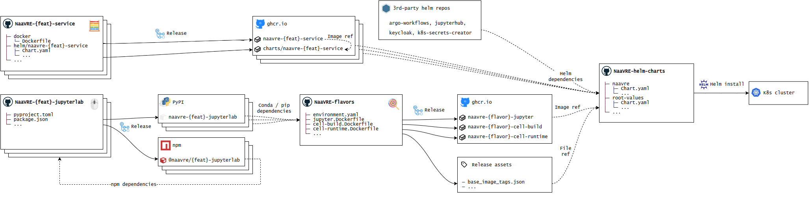

## NaaVRE CI and deployment

### Overview

The figure gives an overview of the release and deployment for the different NaaVRE components.

#### API services (`NaaVRE-*-service`)

Each API service has their own GitHub repo containing:

- the source code
- a Dockerfile
- a Helm chart

Upon creation of a release, a GitHub actions workflow builds and tests the app, then builds the docker image and Helm chart, and releases to GitHub's container registry (ghcr.io).

#### JupyterLab UI components (`NaaVRE-*-jupyterlab`)

Each UI components that is a JupyterLab extensions has their own GitHub repo, built from the [JupyterLab extension template](https://github.com/jupyterlab/extension-template).

Upon creation of a release, the extension is built into a prebuilt JupyterLab extension and published to [PyPI](https://pypi.org/).
In parallel, it is built as a JS package and published to [npm](https://www.npmjs.com/).
The former is used when deploying NaaVRE, while the latter may be included in other extensions.

#### Flavors

Flavors are sets Docker images for NaaVRE. Each flavor consists of three images:
- a Jupyter image (`naavre-{flavor}-jupyter`), which contains JupyterLab with the NaaVRE JupyterLab extensions installed
- a base image for the build stage of containerized cells (`naavre-{flavor}-cell-build`)
- a base image for the runtime stage of containerized cells (`naavre-{flavor}-cell-runtime`)

The default “vanilla” flavor contains the basic dependencies needed to run NaaVRE.
Other flavors contain additional dependencies for specific use-cases or virtual labs.

Upon creation of a release, all images are built and published to GitHub's container registry (ghcr.io).
In addition, a file `base_image_tags.json` is attached to the release.
This file contains a mapping between flavor names and image tags.

#### Helm chart (`NaaVRE-helm`)

The above components are brought together by the NaaVRE Helm charts.
It includes the charts released by individual API services, charts from third-party services (e.g. Argo Workflows), and the [z2jh](https://z2jh.jupyter.org) for JupyterHub and JupyterLab.
For JupyterLab, the z2jh chart is configured to use the flavor's images.

### Deployment

NaaVRE is deployed on Kubernetes with the Helm. 
Follow instructions in [NaaVRE-helm](https://github.com/NaaVRE/NaaVRE-helm) to set up a new deployment.
