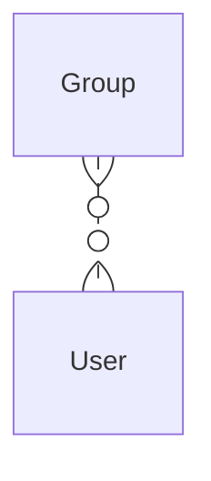
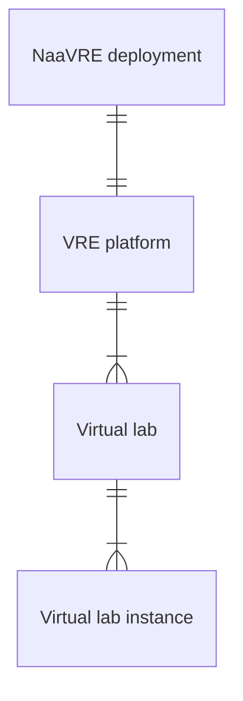
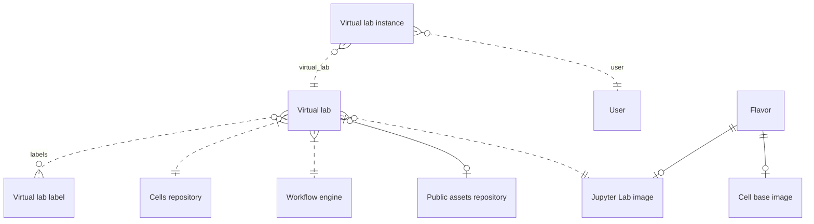
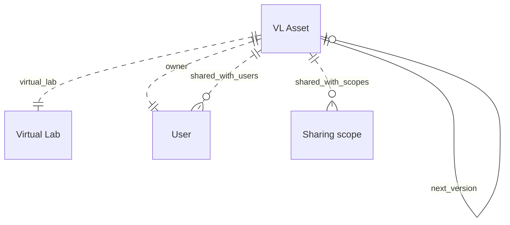
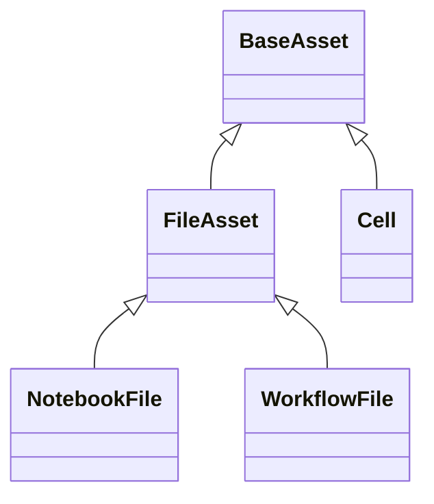
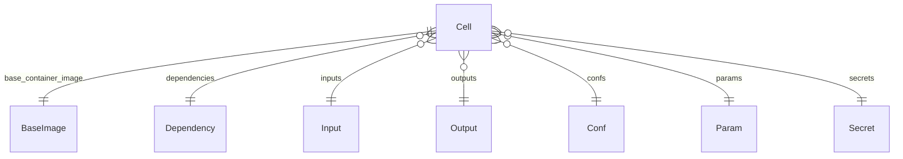
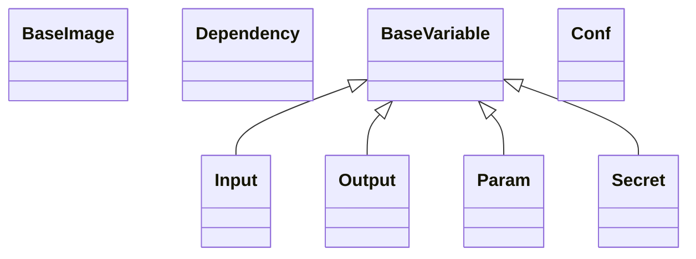

# Data entities

This documents the data entities in the _current_ NaaVRE implementation.

Diagrams use crow's foot notation for cardinality. See the [mermaid documentation](https://mermaid.js.org/syntax/entityRelationshipDiagram.html) for details.

## Users and groups

**Users** and **Groups** are stored in Keycloak (see [authentication](./overview.md#authentication)).
Identity and group membership is carried by the OIDC access token (JWT).

Group membership is used by services receiving the access token to grant permissions. Examples:
- JupyterHub allows members of group `users` to start virtual labs,
- JupyterHub and NaaVRE-workflow-service mount private S3 buckets for members of group `s3-{bucket name}-users`.

The NaaVRE-catalogue-service keeps an internal representation of **Users** as a `django.contrib.auth.models.User`. Django `Users` are kept in sync with the Keycloak ones upon authentication with an access token.

## NaaVRE deployments, virtual labs

- **NaaVRE deployment:** a deployment of NaaVRE, running on Kubernetes environment. Deployments are defined in [NaaVRE-helm/values](https://github.com/NaaVRE/NaaVRE-helm/tree/main/values).

- **VRE platform:** the services supporting the creation and operation of virtual labs.

- **Virtual lab:** a collaborative space for a community or use-case.

- **Virtual lab instance:** a Jupyter Lab instance for a given **virtual lab**, allowing a specific **user** to access **VL assets**, use them, and create new ones.

## Virtual labs

- **Virtual lab:** a collaborative spaces for a community or use-case.
  Virtual labs are defined in [NaaVRE-helm/values/virtual-labs](https://github.com/NaaVRE/NaaVRE-helm/tree/main/values/virtual-labs).
  Upon deployment, a [`VirtualLab`](https://github.com/NaaVRE/NaaVRE-catalogue-service/blob/main/app/virtual_labs/models.py#L5-L23) is created in the NaaVRE-catalogue-service.

- **Virtual lab label:** an arbitrary text labels that are applied to virtual labs. Labels are usually created for funded projects (e.g. “LTER-LIFE” or “Marco-Bolo”), for maturity level, or to indicate virtual lab features (e.g. “Tutorial” or “Experimental features”).
  Virtual lab labels are defined in [NaaVRE-helm/values/virtual-labs/labels.yaml](https://github.com/NaaVRE/NaaVRE-helm/blob/main/values/virtual-labs/labels.yaml#26).
  Upon deployment, a [`VirtualLabLabel`](https://github.com/NaaVRE/NaaVRE-catalogue-service/blob/main/app/virtual_labs/models.py#L5) is created in the NaaVRE-catalogue-service.

- **Cells repository:** a GitHub repository used to build workflows components by containerizing a notebook cell. Forked from [NaaVRE-cells](https://github.com/NaaVRE/NaaVRE-cells).

- **Workflow engine:** an Argo workflows instance.

- **Public assets repository:** a git repository holding public assets created by the virtual lab developer. When a virtual lab instance is created for a user, the public assets repository is cloned in `~/Virtual Labs/{virtual lab name}/Git Public/`.

- **Flavor:** a set of docker images containing a software environment (conda) containing dependencies for a **virtual lab** or use-case. Flavors contain three docker images.

- **Jupyter Lab image:** the docker image for running an instance of the **virtual lab**. This image contains:
  - Jupyter Lab
  - NaaVRE frontend extensions
  - The **flavor** conda environment

- **Cell base images:** two base images used when containerizing a **notebook cell** into a **workflow component**.

## Virtual lab assets

- **Virtual asset:** a generic asset owned by a **user** and part of a **virtual lab**. There are several kinds of assets (see list below). Assets can be versioned and shared with other **users** or within **sharing scopes**. Virtual lab assets are stored in the NaaVRE-catalogue-service as different classes (see below).
- **Sharing scope:** a context within which assets are shared. Sharing scopes are stored in the NaaVRE-catalogue-service as [`SharingScope`](https://github.com/NaaVRE/NaaVRE-catalogue-service/blob/main/app/base_assets/models.py). Sharing scopes are created for **virtual labs** and for **communities**. **Communities** are defined in [NaaVRE-helm/values/virtual-labs/communities.yaml](https://github.com/NaaVRE/NaaVRE-helm/blob/main/values/virtual-labs/communities.yaml).

### Notebook files

- **Notebook file** ([`NotebookFile`](https://github.com/NaaVRE/NaaVRE-catalogue-service/blob/main/app/notebook_files/models.py#L5) in the NaaVRE-catalogue-service): a `.ipynb` file stored in S3.

### Workflow files

- **Workflow file** ([`WorkflowFile`](https://github.com/NaaVRE/NaaVRE-catalogue-service/blob/main/app/workflow_files/models.py#L5) in the NaaVRE-catalogue-service): : a `.naavrewf` file stored in S3.

### Workflow components

- **Workflow component** ([`Cell`](https://github.com/NaaVRE/NaaVRE-catalogue-service/blob/main/app/workflow_cells/models.py#L80) in the NaaVRE-catalogue-service): representation of a workflow component, linking to a docker image, and which can be used to compose a workflow. Workflow components have defined inputs, outputs, confs, dependencies, parameters and secrets. These fields are generated by the NaaVRE-containerizer-service when analyzing a cell ([user documentatino](https://naavre.net/docs/NaaVRE_documentation/component-containerizer/)), and used when composing and running a workflow ([user documentation](https://naavre.net/docs/NaaVRE_documentation/experiment-manager/))

