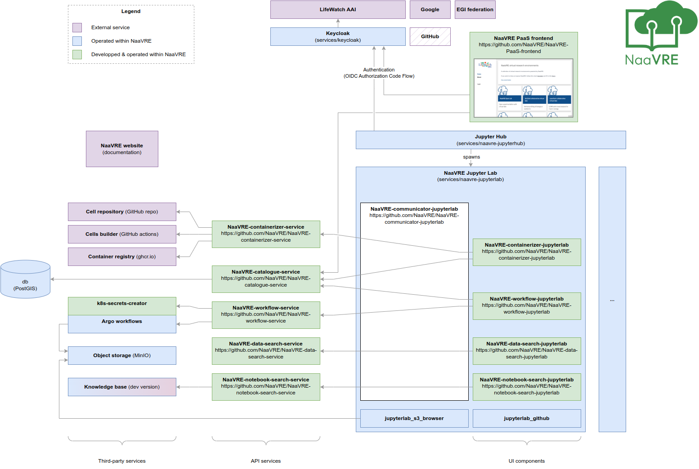

## NaaVRE implementation

The diagram below shows the architecture of the current implementation of NaaVRE. It uses the component types and communication model described in the [Overview](./overview.md) section.

For comparison purposes, the diagram below shows the architecture of the old [monolithic NaaVRE](https://github.com/QCDIS/NaaVRE) implementation:

